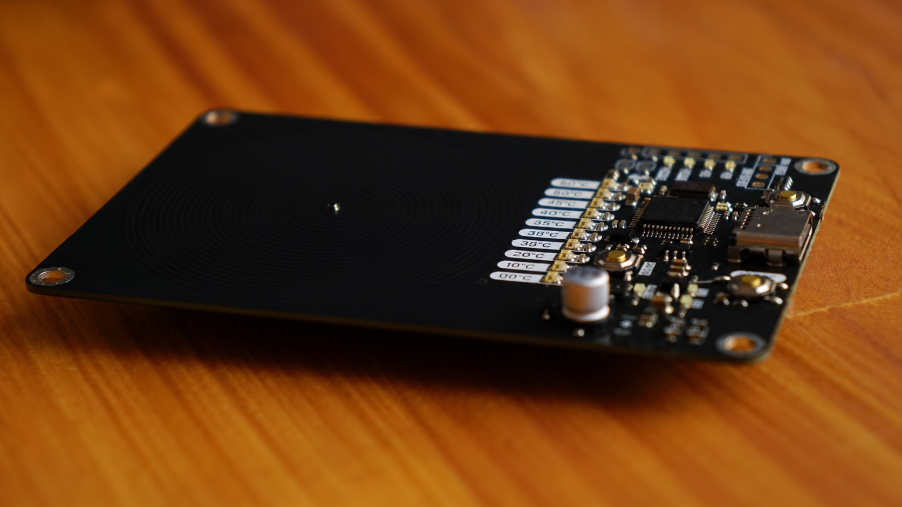

**Tea Cozy Hotplate**
=====================================

### Overview

The Tea Cozy Hotplate is a USB-C powered, closed-loop temperature-controlled hotplate sized to sit under a single cup of tea. An STM32F103C8T6 ("Blue Pill" class MCU) reads a thermistor bonded to the underside of the heating coil, PWM drives two low-side NMOS switches to regulate power into a spiral PCB heater trace, and reports the current setpoint on a ten segment WS2812B ("Neopixel") LED bar that doubles as a 0 to 90 degrees C temperature dial. Two buttons let you nudge the setpoint up or down in 10 degree steps, and the whole board is bus powered off a single USB-C cable, with no separate power brick required.

### How It Works
**Power in.** 5V arrives on the USB-C receptacle (`J2`), passes through a pair of 1.5A resettable (PTC) fuses on VBUS, and is clamped by an `SRV05` ESD protection array on D+/D- and the CC lines. A single 2.2 ohm sense resistor pair plus 5.1kΩ pull downs on CC1/CC2 tell the upstream USB-C source the board is a fixed 5V/1.4A(ish) legacy sink. There is no PD negotiation chip, just resistor based CC termination, so any 5V USB-C source works. A `XC6206P332MR` LDO steps 5V down to a clean 3.3V rail for the MCU, LEDs, and sensors. A Zener (`D2`, ZMM5V6) sits across VBUS as extra transient protection.

**The heater.** The "hotplate" itself is not a separate component, it is a spiral trace etched directly into the PCB copper, measuring roughly 3.75 ohms in the assembled board, generated in KiCad with its built in Coil Generator tool (see the JLCPCB Heater Coil section below for the exact settings and trace math). Two `AO3400A` N-channel MOSFETs (`U3`/`U4`) sit low side between the coil and ground, each gated through a 4.7kΩ series resistor off the MCU's `Hotplate_EN` PWM line (rated for up to about 33kHz switching per the schematic notes). A flyback diode (`D1`, 1N5819WS Schottky) protects the switches from inductive kickback. The STM32 runs a PWM duty cycle proportional to the error between the setpoint and the measured coil temperature, essentially a bang bang or PID control loop over a resistive heater, similar to a soldering iron controller.

**Temperature sensing.** Two 47kΩ NTC thermistors are read as simple resistor divider ADC inputs. One (`Temp_Coil`) is thermally bonded near the heating coil to close the control loop, and a second (`Temp_Mosfet`) monitors the driver FETs so firmware can back off PWM if the switches themselves start overheating, giving thermal protection headroom beyond just controlling cup temperature.

**Display and setpoint.** Ten `WS2812B` addressable RGB LEDs, one per 10 degree step from 0 to 90 degrees C, are chained off a single data line (`Neopixel_Bus`) driven directly by an MCU GPIO, with no separate LED driver IC needed. Two tactile buttons (`SW2`/`SW3`, "Up"/"Down" in the schematic) step the setpoint in 10 degree increments, and the firmware lights LEDs up to the current setpoint.

**Programming and debug.** The board exposes both an SWD header (`SWDIO`/`SWDCLK`/GND/3V3) for use with an ST-Link V2, and a separate serial header (`MCU_TX`/`MCU_RX`/`Reset`/`BOOT0`) with its own status LEDs, so firmware can be flashed over SWD or bootloaded over UART without opening a case. Dedicated `Reset` and `BOOT0` push buttons plus solder jumpers (`JP1`/`JP2`) let you force the STM32 into its UART bootloader without needing to touch the board with tweezers.

### Features

* Closed-loop temperature control, plus or minus 2 degrees C accuracy
* Compact design fits most tea cups
* 10 segment addressable LED bargraph for setpoint/temperature display (0 to 90 degrees C in 10 degree steps)
* Up/down buttons for setpoint adjustment
* Powered entirely via USB-C (5V, about 1.4A budget, PTC fused)
* Dual NTC thermistors, one for coil temp (control loop), one for driver FET temp (protection)
* STM32F103C8T6 microcontroller, 72MHz Arm Cortex-M3
* Dedicated SWD and UART programming headers with BOOT0/Reset buttons for field reflashing

### Specifications

#### STM32 Specifications

* **CPU**: Arm Cortex-M3 @ 72MHz
* **Flash**: 64KB
* **RAM**: 20KB
* **Package**: LQFP-48

#### Components

* **Microcontroller**: STM32F103C8T6
* **LDO Regulator**: XC6206P332MR (5V to 3.3V)
* **ESD Protection**: SRV05 (USB D+/D-, CC1/CC2)
* **Fuse**: 2 x 1.5A Resettable Fuses (VBUS)
* **USB Connector**: USB-C Receptacle
* **Heater Driver**: 2 x AO3400A NMOS (low-side switching), 4.7kΩ gate resistors, 1N5819WS flyback diode
* **Heating Element**: ~3.75Ω Spiral PCB Coil (34 turns, 1 layer, 50mm outer diameter, 0.55mm trace width, 0.15mm spacing)
* **Temperature Sensors**: 2 x 47kΩ NTC Thermistor (coil + driver FET)
* **Display**: 10 x WS2812B addressable RGB LEDs (0-90°C bargraph)
* **User Input**: Up/Down setpoint buttons, Reset button, BOOT0 button

### Assembly and Programming

* Program the STM32 microcontroller using an ST-Link V2 via the SWDIO header, or bootload over the UART header (`MCU_TX`/`MCU_RX`) using the `BOOT0`/`Reset` buttons or `JP1`/`JP2` jumpers to force bootloader mode.

## JLCPCB Heater Coil (1mm PCB with 1oz/ft^2)

* **Trace**: 2.8m length, 0.55mm width, 1oz/ft^2
* **Calculated Resistance**: 2.47Ω (assuming 0.000017Ω.mm)
* **Real-World Resistance**: 3.75Ω (calculated to be 0.0000258Ω.mm)
